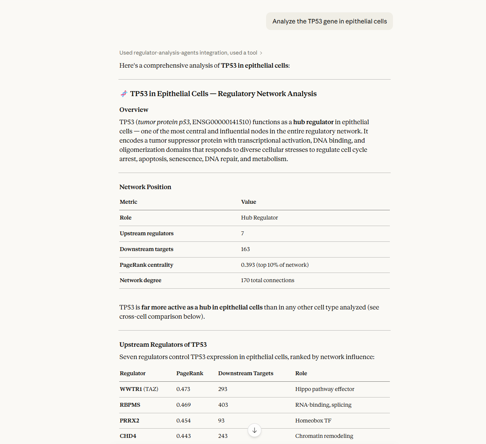

# RegNetAgents

[](https://opensource.org/licenses/MIT)
[](https://www.python.org/downloads/)
[](https://doi.org/10.5281/zenodo.18500027)

**Multi-Agent System for Gene Regulatory Network Interpretation**

Analyzing a gene regulatory network typically means hours of manual database queries across STRING, Reactome, and BioGRID — one gene at a time. RegNetAgents automates the entire workflow: ask a question in plain English through Claude Desktop or any MCP-compatible client, and get a full multi-domain regulatory analysis in seconds.

Four specialized agents — cancer biology, drug discovery, clinical relevance, and systems biology — run in parallel and produce deterministic, reproducible assessments. LLM narrative is optional; the rule-based engine runs without any API keys or local models.



**Ask questions like:**
```
Analyze the TP53 gene in epithelial cells
Compare MYC, TP53, and KRAS across different cell types
These genes are upregulated in my RNA-seq experiment: TP53, CDKN1A, MDM2, BAX, CCND1.
Which transcription factors are most likely driving this signature in epithelial cells?
Compare MYC regulatory wiring between epithelial cells and colorectal tumor context
```

---

## Data Sources

**Bundled (no download required):**
- **GREmLN** (Zhang et al. 2025): 10 cell-type-specific ARACNe networks, population-averaged from 11M cells across 162 cell types (CELLxGENE Census 2024-07-01, CZ Biohub NY / Columbia University Califano Lab)
- **TCGA ARACNe** (Lim & Califano): 8 cancer-type-specific tumor-state networks (brca, coad, hnsc, luad, lusc, ov, prad, ucec) — pre-built PKL caches included in the repo

To rebuild TCGA caches from source, see [INSTALL.md](INSTALL.md) for instructions using the Bioconductor `aracne.networks` package.

See [DATA_SOURCES.md](docs/DATA_SOURCES.md) for complete details.

---

## Quick Start

**Time required:** 5-10 minutes

### Prerequisites

- Python 3.10+
- Claude Desktop
- Internet connection (for Reactome API)

### Installation

The pre-computed ARACNe network files for all 10 cell types are included in the repository — no separate download is required.

```bash
# Clone and setup
git clone https://github.com/jab57/RegNetAgents.git
cd RegNetAgents
python -m venv env

# Activate (Windows)
env\Scripts\activate
# Activate (Linux/Mac)
source env/bin/activate

# Install dependencies
pip install -r requirements.txt
```

### Install Ollama (Optional)

LLM agents are **off by default** (`USE_LLM_AGENTS=false`). The system runs entirely on rule-based analysis without any LLM. This is the recommended mode for MCP clients (Claude Desktop, Cursor, Zed).

To enable LLM-powered insights with local Ollama:

```bash
# Download from https://ollama.com/download
ollama pull llama3.1:8b
cp .env.example .env
# Then set USE_LLM_AGENTS=true in .env
```

To use Ollama Cloud (no local install required, free tier available):

```bash
# In .env:
USE_LLM_AGENTS=true
LLM_PROVIDER=ollama
OLLAMA_API_KEY=your-ollama-cloud-key-here   # from https://ollama.com/settings
OLLAMA_MODEL=gemini-3-flash-preview         # or another cloud model
# OLLAMA_HOST is ignored when OLLAMA_API_KEY is set
```

To use a cloud LLM provider instead (OpenAI, Anthropic, or any OpenAI-compatible API):

```bash
# In .env:
USE_LLM_AGENTS=true
LLM_PROVIDER=openai            # or: anthropic | openai_compatible
LLM_API_KEY=sk-...
LLM_MODEL=gpt-4o-mini          # or claude-haiku-4-5-20251001, etc.
# LLM_API_BASE=https://api.groq.com/openai/v1  # for openai_compatible
```

### Configure MCP Client

Works with any MCP-compatible client. Example for Claude Desktop:

Add to `claude_desktop_config.json`:
- **Windows**: `%APPDATA%\Claude\claude_desktop_config.json`
- **Mac**: `~/Library/Application Support/Claude/claude_desktop_config.json`

```json
{
  "mcpServers": {
    "regnetagents": {
      "command": "python",
      "args": ["C:\\path\\to\\RegNetAgents\\regnetagents_langgraph_mcp_server.py"]
    }
  }
}
```

Replace path with your actual installation path. Restart your MCP client. Other clients (Cursor, Zed, etc.) use the same JSON structure — consult their documentation for config file location.

### Verify Installation

```bash
python verify_installation.py
```

Expected: `5/7 checks passed` or better (Git LFS and Ollama are optional)

### Test It

In Claude Desktop:
```
Analyze the TP53 gene in epithelial cells
```

### Programmatic Usage

No Claude Desktop required — call the workflow directly from Python:

```python
import asyncio
from regnetagents_langgraph_workflow import RegNetAgentsWorkflow

async def main():
    workflow = RegNetAgentsWorkflow()
    result = await workflow.run_analysis(
        gene="TP53",
        cell_type="epithelial_cell",
        analysis_depth="comprehensive"
    )
    print(result["network_summary"])

asyncio.run(main())
```

For a minimal single-gene example (2–5 seconds, no API keys needed):

```bash
python examples/quickstart.py
```

```
RegNetAgents Quick Start — analyzing TP53 in epithelial_cell
------------------------------------------------------------

Network topology (epithelial_cell):
  Regulatory role        : hub_regulator
  Upstream regulators    : 7
  Downstream targets     : 163
  Top upstream regulator : WWTR1 (PageRank: 0.473)

Pathway enrichment:
  Total pathways         : 16
  Significant (FDR<0.05) : 16

Domain insights (rule-based):
  Oncogenic potential    : low
  Druggability           : high
------------------------------------------------------------
Done.
```

For cross-context comparison (GREmLN vs TCGA):

```bash
python examples/context_comparison.py
```

```
Comparing MYC regulatory wiring:
  Population-averaged context : epithelial_cell (GREmLN)
  Tumor-state context         : tcga_coad (colorectal)

Gene: MYC
Regulatory rewiring: HIGH
Regulator conserved fraction: 0.0%

--- Regulators ---
  Population-averaged total : 25
  Tumor-state total         : 16
  Conserved (0)             : none
  Population-averaged only  : BCL11A, CHD2, EGR1, EGR2, FOS, HEY1, ID4, ...
  Tumor-state only (16)     : CARM1, MEF2C, RNF43, TACSTD2, WT1, ...

--- Targets ---
  Population-averaged total : 427
  Tumor-state total         : 189
  Conserved                 : 5 (0.8%)
```

For a full multi-gene panel example:

```bash
python demo_biomarker_analysis.py
```

Example output (5-gene colorectal cancer panel, LLM-powered mode):

```
Genes: MYC, CTNNB1, CCND1, TP53, KRAS | Cell Type: epithelial_cell

[OK] MYC:   hub_regulator  | Regulators: 25  | Targets: 427 | Pathways: 58  | Top regulator: ID4   (PageRank: 0.622)
[OK] CTNNB1:hub_regulator  | Regulators: 18  | Targets: 310 | Pathways:  2  | Top regulator: CHD2  (PageRank: 0.530)
[OK] CCND1: heavily_reg.   | Regulators: 42  | Targets:   0 | Pathways: 66  | Top regulator: ZBTB20(PageRank: 0.600)
[OK] TP53:  hub_regulator  | Regulators:  7  | Targets: 163 | Pathways: 16  | Top regulator: WWTR1 (PageRank: 0.473)
[OK] KRAS:  weakly_reg.    | Regulators:  7  | Targets:   0 | Pathways: 141 | Top regulator: GPBP1 (PageRank: 0.609)

Analyzed 5 genes in 104.68 seconds
```

---

## Running Tests

```bash
pip install pytest pytest-asyncio pytest-cov
pytest tests/ --cov=regnetagents_langgraph_mcp_server --cov=regnetagents_langgraph_workflow --cov-report=term-missing
```

Core tests run without Ollama or Claude Desktop. Tests requiring Ollama are skipped automatically if it is not running.

---

## Features

- **Network Analysis**: Gene positions in regulatory networks
- **Therapeutic Target Prioritization**: PageRank-based ranking of upstream regulators
- **10 Cell Types**: Immune cells, blood cells, epithelial tissue
- **Domain Insights**: 4 agents produce categorical assessments (high/moderate/low) with evidence factors derived from network topology
- **Cross-Domain Contradiction Detection**: Automatic rule-based flagging of inconsistencies across domain agents
- **Pathway Enrichment**: Reactome API with FDR correction
- **Dual Mode**: Optional LLM narrative (Ollama, OpenAI, Anthropic, or compatible) on top of deterministic rule-based analysis
- **Optional LLM Reconciliation**: Cross-domain narrative synthesis (`USE_LLM_RECONCILIATION=true`)

### Configuration

Key environment variables (set in `.env`):

| Variable | Default | Description |
|----------|---------|-------------|
| `USE_LLM_AGENTS` | `false` | Enable LLM-powered domain agents |
| `LLM_PROVIDER` | `ollama` | LLM backend: `ollama` \| `openai` \| `anthropic` \| `openai_compatible` |
| `LLM_API_KEY` | — | Required for cloud providers |
| `LLM_MODEL` | — | Override model (e.g. `gpt-4o-mini`, `claude-haiku-4-5-20251001`) |
| `LLM_API_BASE` | — | Base URL for `openai_compatible` providers (e.g. Groq, Together) |
| `USE_LLM_RECONCILIATION` | `false` | Enable LLM cross-domain narrative synthesis |
| `OLLAMA_MODEL` | `llama3.1:8b` | Ollama model name (local or cloud) |
| `OLLAMA_HOST` | `http://localhost:11434` | Ollama server URL (local only) |
| `OLLAMA_API_KEY` | — | Ollama Cloud API key (omit for local; get from ollama.com/settings) |

### MCP Tools

| Tool | Description |
|------|-------------|
| `validate_gene` | Quick gene name check with fuzzy suggestions (<100ms) |
| `query_network` | Instant network queries — top regulators, targets, neighbors, stats (<50ms); supports GREmLN (`network_source="cell_type"`) and TCGA tumor-state networks (`network_source="tcga"`) |
| `find_master_regulators` | Identify TFs driving a gene signature (Fisher's exact test enrichment); works with both GREmLN and TCGA networks |
| `compare_network_contexts` | Compare regulatory wiring for a gene across population-averaged (GREmLN) and tumor-state (TCGA) networks; returns conserved/context-specific regulators and rewiring classification |
| `comprehensive_gene_analysis` | Full multi-agent domain analysis (cancer biology, druggability, clinical actionability, systems biology); accepts GREmLN cell-type (`cell_type`) or TCGA cancer-type (`tcga_network`) as network source |
| `multi_gene_analysis` | Parallel processing of multiple genes |
| `pathway_focused_analysis` | Reactome pathway enrichment |
| `cross_cell_comparison` | Gene behavior across cell types |
| `load_gene_results` | Load previously saved analysis results |
| `list_available_results` | List available result files |
| `export_results` | Export analysis as markdown or CSV for manuscripts and spreadsheets |
| `workflow_status` | Execution monitoring |
| `workflow_insights` | Performance analytics |
| `create_analysis_report` | Generate reports |
| `list_prompts` | List available MCP prompt templates |

### MCP Resources

Browsable resources for discovering available data without running analyses:

| Resource URI | Description |
|-------------|-------------|
| `regnetagents://cell-types` | List all cell types with gene/edge counts |
| `regnetagents://network/{cell_type}` | Network summary: density, top regulators by PageRank |
| `regnetagents://gene/{gene_symbol}` | Gene lookup across all cell types (template) |

### MCP Prompts

Guided prompt templates that scaffold common analysis workflows in the MCP client:

| Prompt | Arguments | Description |
|--------|-----------|-------------|
| `gene_deep_dive` | `gene`, `cell_type` | Validates gene, runs full analysis, queries neighbors, summarizes regulatory role and clinical relevance |
| `cancer_biomarker_panel` | `cancer_type`, `cell_type` | Runs multi-gene parallel analysis for a pre-defined cancer panel (colorectal, breast, lung, prostate, general) |
| `cross_cell_comparison` | `gene` | Compares gene behavior across all 10 cell types, highlighting immune vs. epithelial differences |
| `tumor_context_analysis` | `gene`, `cancer_type` | Full domain analysis against a TCGA tumor-state network; MoA breakdown, master regulators, druggability, clinical actionability |
| `network_context_comparison` | `gene`, `cancer_type` | Compares population-averaged (GREmLN epithelial) vs. tumor-state (TCGA) regulatory context; conserved vs. context-specific regulators |
| `candidate_prioritization` | `gene`, `cancer_type` | Two-step workflow: source-labeled candidate shortlist via `compare_network_contexts`, then `comprehensive_gene_analysis` per candidate with source-driven network routing |

---

## Cell Types (10 Available)

**Immune & Blood**: CD4/CD8 T cells, CD14/CD16 Monocytes, CD20 B cells, NK/NKT cells, Erythrocytes, Dendritic cells

**Epithelial**: Epithelial cells (183,247 edges - largest network)

See [ADDING_NEW_CELL_TYPES.md](docs/ADDING_NEW_CELL_TYPES.md) to expand.

---

## Troubleshooting

| Problem | Solution |
|---------|----------|
| Network index missing | Run `python scripts/build_network_cache.py --all` |
| Tools not in Claude Desktop | Check path in config, use absolute path, restart |
| Module not found | Activate venv, run `pip install -r requirements.txt` |
| Empty results | Use `validate_gene` to check gene name first |
| Pathway analysis fails | Check internet connection |
| LLM agents not running | Set `USE_LLM_AGENTS=true` in `.env`; check `LLM_PROVIDER` and credentials |
| Ollama model not found | Run `ollama pull llama3.1:8b` (or the model set in `OLLAMA_MODEL`) |

---

## Performance

| Mode | Single Gene | 5 Genes |
|------|-------------|---------|
| Rule-based | 0.6 sec | ~10 sec |
| LLM-powered | ~23 sec | ~110 sec |

---

## Project Structure

```
RegNetAgents/
├── regnetagents_langgraph_mcp_server.py  # MCP server
├── regnetagents_langgraph_workflow.py    # Core workflow
├── regnetagents/                          # Package
├── examples/                              # Minimal usage examples
│   ├── quickstart.py                     # Single-gene quick start
│   └── tcga_query.py                     # TCGA tumor-state network example
├── models/networks/                       # Network data (10 GREmLN cell types + optional TCGA)
├── tests/                                 # Test suite
├── docs/                                  # Documentation
└── scripts/                               # Utilities
```

---

## Documentation

- [REGNETAGENTS_MCP_SETUP.md](docs/REGNETAGENTS_MCP_SETUP.md) - Setup guide
- [DATA_SOURCES.md](docs/DATA_SOURCES.md) - Cell types and sources
- [REGNETAGENTS_Analysis_Pipeline.md](docs/REGNETAGENTS_Analysis_Pipeline.md) - Architecture
- [docs/README.md](docs/README.md) - Full index

---

## Development Context

This project was developed with assistance from Claude Code (Anthropic). It is a research prototype for hypothesis generation—users should validate findings experimentally. See [CONTRIBUTING.md](CONTRIBUTING.md) for contribution guidelines.

---

## Citation

If you use RegNetAgents in your research, please cite:

```bibtex
@software{bird_2026_regnetagents,
  author    = {Bird, Jose A.},
  title     = {RegNetAgents: Multi-Agent LLM Framework for Gene Regulatory Network Analysis},
  year      = {2026},
  version   = {1.0.3},
  doi       = {10.5281/zenodo.18500027},
  url       = {https://github.com/jab57/RegNetAgents},
  license   = {MIT}
}
```

Bird, J.A. (2026). *RegNetAgents: Multi-Agent LLM Framework for Gene Regulatory Network Analysis* (v1.0.3). https://doi.org/10.5281/zenodo.18500027

---

## License

MIT License - see [LICENSE](LICENSE)
