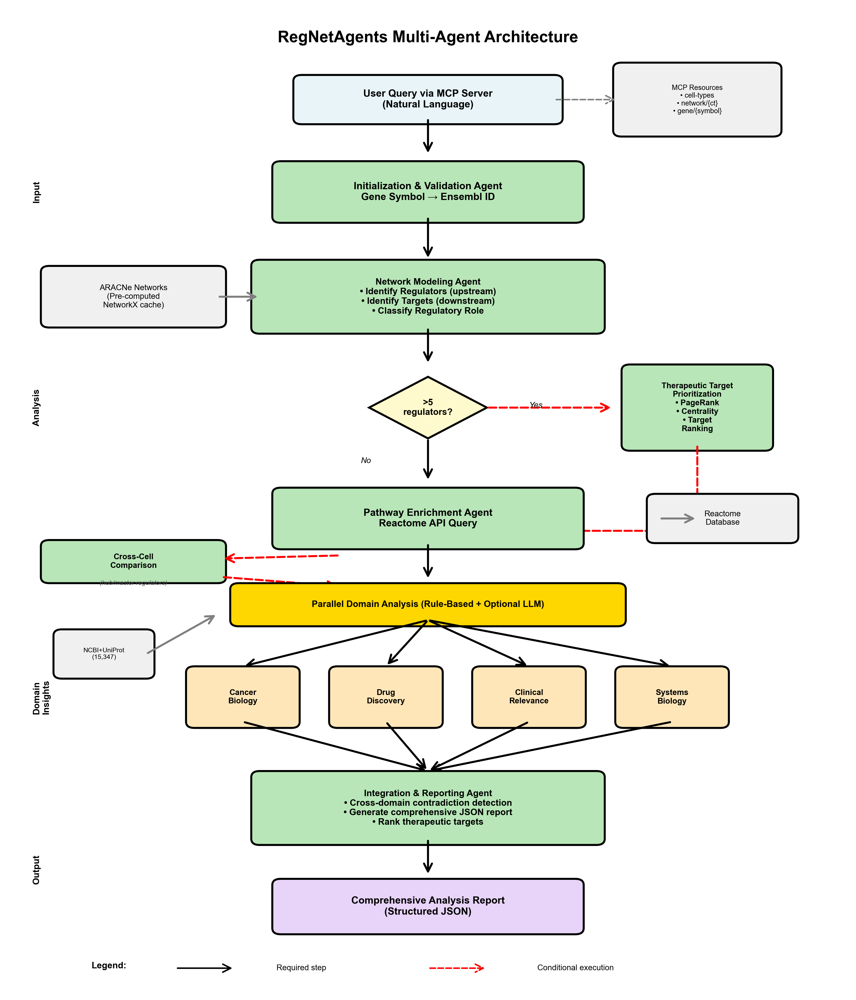

# Summary

RegNetAgents is a Python package for automated downstream analysis of pre-computed gene regulatory networks (GRNs) using a multi-agent architecture built on LangGraph [@langgraph]. The core engine coordinates four specialized rule-based domain agents—cancer biology, drug discovery, clinical relevance, and systems biology—that each produce deterministic evidence assessments (high/moderate/low) for regulatory genes in ARACNe-inferred networks [@margolin2006aracne; @lachmann2016aracne]. An optional LLM layer adds natural-language narrative rationale without altering these assessments. The system can be used programmatically via Python or through MCP-compatible AI clients (Claude Desktop, Cursor, Zed) [@mcp], allowing researchers to perform analyses by asking questions in plain English without writing code. RegNetAgents is intended for computational biologists, bioinformaticians, and researchers who need automated GRN analysis.

The architecture separates workflow logic from LLM interpretation: a fixed directed acyclic graph (DAG) controls execution order and data flow. This separation ensures that identical inputs produce identical computational outputs, with LLM variability isolated to the interpretation layer. RegNetAgents thus provides a reproducible entry point for downstream GRN interpretation.

# Statement of Need

Researchers analyzing gene regulatory networks typically query multiple databases manually (STRING, BioGRID, Reactome), export data across platforms, and synthesize findings—a process requiring hours per gene and programming expertise. RegNetAgents addresses this gap with a reproducible, deterministic multi-agent workflow that performs regulator/target identification, therapeutic prioritization, pathway enrichment, and domain-specific interpretation in a single automated pipeline. Both a Python API and a natural-language MCP interface are supported, removing the programming barrier for non-expert users. In a five-gene colorectal cancer case study, the system analyzed 99 upstream regulators in approximately 10 seconds (rule-based mode) to 110 seconds (LLM-powered mode) in a single cell type; extending this analysis across all 10 supported cell types takes approximately 100 seconds (rule-based). The equivalent manual workflow—querying regulators and targets across 10 cell types, performing pathway enrichment for each, and synthesizing findings across four biological perspectives per gene—requires an estimated 7–12 hours based on a systematic task decomposition (approximately 6–9 minutes per gene-cell-type pair for network lookup and Reactome pathway enrichment, plus 28–53 minutes per gene for STRING and BioGRID queries and cross-domain synthesis; for five genes across ten cell types this sums to 7–12 hours), a speedup of approximately two to three orders of magnitude (\autoref{fig:performance}).


RegNetAgents processes pre-computed ARACNe networks from two sources: the GREmLN project [@zhang2026gremln], covering 10 population-averaged cell types (1 epithelial and 9 immune/blood cell types including T cells, monocytes, B cells, NK/NKT cells, erythrocytes, and dendritic cells) from large single-cell RNA-seq datasets [@megill2021cellxgene]; and TCGA ARACNe networks [@alvarez2016functional] for 8 epithelial-origin cancer types (brca, coad, hnsc, luad, lusc, ov, prad, ucec), enabling direct comparison of population-averaged and tumor-state regulatory wiring for the same gene.

# State of the Field

Established tools address individual components of GRN analysis workflows: Cytoscape [@shannon2003cytoscape] provides interactive network visualization, pySCENIC [@aibar2017scenic] and CellOracle [@kamimoto2023dissecting] infer regulatory networks from expression data, and STRING [@szklarczyk2023string] catalogs known protein interactions. However, these tools operate on separate steps that must be manually connected, require programming expertise, and produce outputs that need expert interpretation across multiple biological contexts. They focus on network inference or visualization, whereas RegNetAgents operates downstream, automating multi-perspective interpretation of pre-computed networks with a fixed DAG that guarantees identical outputs for identical inputs. Unlike general-purpose agent frameworks [@autogpt; @li2023camel; @hong2023metagpt], RegNetAgents provides domain-specific scientific workflow integration with deterministic reproducibility. The core scientific contribution is the analytical engine itself: cell-type-specific empirical thresholds for domain assessments, PageRank-based therapeutic prioritization, Fisher's exact test master regulator identification, FDR-corrected pathway enrichment, and cross-domain contradiction detection. The pre-computed ARACNe networks serve as validated input data — analogous to how tools such as DESeq2 [@love2014deseq2] operate on standard RNA-seq count matrices without generating the underlying sequencing data. To our knowledge, no existing tool provides an integrated GRN analysis platform combining deterministic multi-domain interpretation with MCP-based tool exposure, enabling AI agents to invoke reproducible bioinformatics workflows programmatically.

# Software Design

RegNetAgents requires Python 3.10+ and uses NetworkX [@hagberg2008networkx] for graph algorithms. The workflow is implemented as a LangGraph DAG that enforces explicit stepwise execution, reduces agent autonomy in exchange for deterministic, auditable execution, and restricts input to pre-computed ARACNe networks to prioritize validated, curated data. The pipeline executes in seven deterministic steps: (1) **gene validation**—symbol normalization and network membership check; (2) **network lookup**—regulator and target retrieval per cell type; (3) **therapeutic prioritization**—PageRank- and centrality-based regulator ranking (conditional on >5 regulators); (4) **pathway enrichment**—Reactome API queries with FDR correction [@gillespie2022reactome]; (5) **cross-cell comparison**—multi-cell regulatory role and pathway consistency (conditional for hub and master regulators); (6) **parallel domain analysis**—concurrent execution of four specialized agents; and (7) **report synthesis**—cross-domain contradiction detection and narrative generation (\autoref{fig:architecture}).



Therapeutic prioritization uses NetworkX's deterministic PageRank and degree-based centrality metrics to rank upstream regulators by influence within the ARACNe-derived subnetwork. The four domain agents each produce an independent evidence assessment (high/moderate/low) for a specific biological dimension: oncogenic potential (cancer agent), druggability (drug discovery agent), clinical actionability (clinical relevance agent), and network centrality (systems biology agent). The rule-based layer—active by default (`USE_LLM_AGENTS=false`)—derives these assessments using empirically derived, cell-type-specific thresholds: the 90th and 75th percentiles of target count, regulator count, and normalized PageRank (computed across all nodes in each cell-type GRN) define the **high** and **moderate** tiers, respectively, so criteria adapt to each network's regulatory scale rather than using fixed values. **High** is assigned when a gene satisfies two or more domain-specific criteria; **moderate** when one is met; **low** when none apply. These thresholds are recomputed automatically when new cell types are added. A cross-domain contradiction checker automatically flags logical inconsistencies across the four domain assessments, including:

- high oncogenic potential with minimal network vulnerability
- high druggability with low clinical actionability
- an inhibition strategy conflicting with high tumor-suppressor likelihood
- a critical network node classified as easy to drug

The optional LLM layer (`USE_LLM_AGENTS=true`) adds natural-language rationales while preserving the same categorical output structure. An optional LLM narrative synthesis step (`USE_LLM_RECONCILIATION=true`) can synthesize cross-domain findings without introducing new assessments. All computational steps—network lookup, PageRank ranking, and pathway enrichment—are fully deterministic; LLM variability is isolated to the interpretation layer.

The MCP server exposes fifteen tools including gene validation (<100 ms), network queries (<50 ms) with ARACNe edge confidence filtering, reverse-direction master regulator analysis (`find_master_regulators`, Fisher's exact test against each regulon), and cross-context regulatory comparison (`compare_network_contexts`). Both `query_network` and `find_master_regulators` support a `network_source` parameter that selects between population-averaged GREmLN networks (`"cell_type"`) and tumor-state TCGA ARACNe networks (`"tcga"`); TCGA results additionally carry a per-edge Mode of Action (MoA) field encoding activating (+1) or repressive (−1) regulatory relationships. `compare_network_contexts` runs both queries internally and returns conserved regulators, context-specific regulators, and a rule-based regulatory rewiring classification (low/moderate/high) based on the Jaccard overlap of regulator sets. New cell types or cancer types can be added through a documented pipeline; additional domain agents could be integrated by extending the parallel analysis step. RegNetAgents runs on Windows, macOS, and Linux. LLM-generated interpretations should be treated as hypotheses rather than validated conclusions. All deterministic outputs are reproducible from the v1.2.0 source archived on Zenodo (DOI: 10.5281/zenodo.18500027), with dependencies pinned and a fourteen-module test suite validating determinism, MCP integration, agent-level behavior, and TCGA network integration.

# Usage

RegNetAgents can be used programmatically via Python or through any MCP-compatible client (Claude Desktop, Cursor, Zed) via natural language (see installation guide):

```
Analyze the TP53 gene in epithelial cells
Compare MYC, TP53, and KRAS across different cell types
```

For reverse-direction analysis — identifying transcription factors that drive a gene signature — users supply a gene list in natural language:

```
These genes are upregulated in my RNA-seq experiment: TP53, CDKN1A, MDM2,
BAX, CCND1, MYC, EGFR, KRAS, CTNNB1, APC. Which transcription factors are
most likely driving this signature in epithelial cells?
```

For cross-context comparison — comparing regulatory wiring between population-averaged and tumor-state networks — users can query directly:

```
Compare MYC regulatory wiring between epithelial cells and colorectal tumor context
```

## Example Application: Colorectal Cancer Gene Panel

The following output is from a five-gene colorectal cancer panel (MYC, CTNNB1, CCND1, TP53, KRAS) analyzed in the GREmLN epithelial cell network (population-averaged). The system identified 99 upstream regulators across all five genes and characterized each gene's network role, top upstream regulator by PageRank, and enriched pathway count:

```
Genes: MYC, CTNNB1, CCND1, TP53, KRAS | Cell Type: epithelial_cell

[OK] MYC:   hub_regulator | Regulators: 25 | Targets: 427 | Pathways: 58 | Top regulator: ID4    (PageRank: 0.622)
[OK] CTNNB1:hub_regulator | Regulators: 18 | Targets: 310 | Pathways:  2 | Top regulator: CHD2   (PageRank: 0.530)
[OK] CCND1: heavily_reg.  | Regulators: 42 | Targets:   0 | Pathways: 66 | Top regulator: ZBTB20 (PageRank: 0.600)
[OK] TP53:  hub_regulator | Regulators:  7 | Targets: 163 | Pathways: 16 | Top regulator: WWTR1  (PageRank: 0.473)
[OK] KRAS:  weakly_reg.   | Regulators:  7 | Targets:   0 | Pathways: 141| Top regulator: GPBP1  (PageRank: 0.609)
```

The repository includes `examples/quickstart.py`, a minimal single-gene entry point (2–5 seconds, no API keys required), and `demo_biomarker_analysis.py` for multi-gene panel analysis:

```python
import asyncio
from regnetagents_langgraph_workflow import RegNetAgentsWorkflow

async def main():
    workflow = RegNetAgentsWorkflow()
    result = await workflow.run_analysis(
        gene="TP53",
        cell_type="epithelial_cell",
        analysis_depth="comprehensive"
    )
    print(result["network_summary"])

asyncio.run(main())
```

# Validation and Applicability

RegNetAgents is designed for immediate use by computational biologists and bioinformaticians working with cell-type-specific GRNs derived from single-cell RNA-seq data. In a five-gene colorectal cancer validation case study, the system recapitulated known regulatory relationships—identifying literature-supported TP53 regulators including WWTR1 and YAP1 (Hippo pathway effectors, FDR = 0.020 for Hippo signaling enrichment)—while completing analysis approximately two to three orders of magnitude faster than equivalent manual workflows. While this case study uses epithelial cell networks, the system operates equivalently for any gene present across the 10 supported cell-type networks, enabling immediate application to immune cell contexts, cross-cell-type comparative analyses, or custom gene panels in other cancer types. The `compare_network_contexts` tool further enables direct comparison of population-averaged and tumor-state regulatory wiring for the same gene, quantifying regulatory rewiring between population-averaged epithelial and tumor contexts. The pre-computed networks originate from the GREmLN project (CZ Biohub NY / Columbia Califano Lab) [@zhang2026gremln], derived from the CELLxGENE Census [@megill2021cellxgene] — a widely used single-cell data resource — providing researchers already working with these regulatory maps an immediately applicable downstream analysis tool. The documented pipeline for adding new cell types further extends applicability to any ARACNe-derived network, broadening the potential user base beyond the current ten cell types. The v1.2.4 release is archived on Zenodo with pinned dependencies and a fourteen-module test suite.

# Availability

RegNetAgents is available at <https://github.com/jab57/RegNetAgents> under the MIT License. The v1.2.4 release is archived on Zenodo (DOI: [10.5281/zenodo.18500027](https://doi.org/10.5281/zenodo.18500027)). Contribution guidelines and issue tracking are provided via GitHub.

# Acknowledgements

Network data were obtained from the GREmLN team's pre-computed ARACNe networks [@zhang2026gremln]. The author designed the system architecture, workflow logic, and reproducibility framework.

# AI Usage Disclosure

Claude Code (Anthropic) was used to assist with software implementation (code generation, debugging, and iterative development) and paper drafting. All scientific decisions, architectural choices, and conclusions are the author's own.

# References
